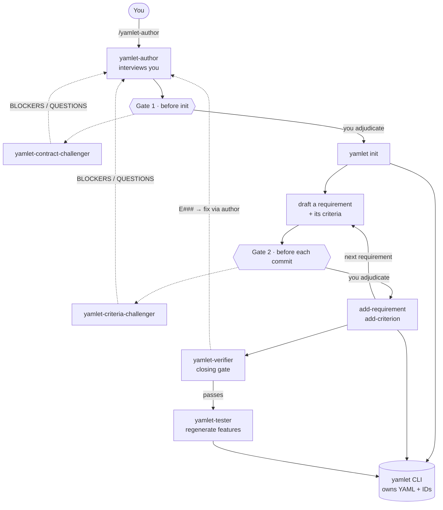

# Yet Another Markup Language Engineering Toolkit

**Yamlet is a minimal, single-source-of-truth spec format for spec-driven development with agents.** One component per `.yamlet.yaml` file — a contract, a handful of requirements, and [EARS](https://alistairmavin.com/ears/) acceptance criteria. Minimal in composition, maximal in meaning: small enough to read in full, strict enough that an agent can't quietly reinterpret the goal.

[**`email_service.yamlet.yaml`**](specs_example/email_service.yamlet.yaml) is a complete example of _one such_ file. There can be many, and that's the point — each a small scope, focused on the exact, minimal, must-fulfill requirements.

## How it works

Specs are authored, verified, and projected into tests — every write driven by the `yamlet` CLI, which owns all YAML and IDs, so nothing is hand-edited:

1. **Author** — the `yamlet-author` skill interviews you and appends to the spec through the CLI, so it's correct by construction. Adversarial _challenger_ skills gate the contract and each criterion before they freeze.
2. **Verify** — `yamlet verify` checks a spec against a mechanical rule catalog, the source of truth for validity.
3. **Project tests** — `yamlet tests` turns every acceptance criterion into a Gherkin `.feature`, ready for your step definitions.
4. **Visualize** — `yamlet graph` emits Graphviz DOT, a JSON model, or a self-contained interactive HTML map of the whole composition.

The `yamlet` CLI runs standalone; the skills are an optional Claude Code plugin on top. [Install →](#install)

## What makes Yamlet so special?

Yamlet is my own try at a reliable, minimalistic setup for spec-driven development with agents — one that doesn't assume you're a hobby startup founder, but serious about the matter and interested in reliable results.

My issue with existing options is that they're verbose and unreliable - the verbosity is at fault here, as it leads agents off through various interpretations of the same goal. Instead of clearly sculpting a goal, they write about how many adjectives fit its description. And nobody reads those in detail, not even agents. Or why are they not following them, hmm? 🧐

But agents suffer from the same pitfalls development teams have suffered the past decades. Unclear requirements, broad scopes, changing goal posts, rushed results, non prioritization of code quality metrics. Until now you paid a pretty penny to people that could manage this field, and could trust their judgement. But agents? They will assume something, misundertand it potentially, and output an avalanche of code based on wrong goals. Good luck reviewing that yourself.

In addition, many of these new "frameworks" are just over the top. Why do I need an mcp server for this? Why do I need 20+ skills to do something?

## Install

`yamlet` is a single self-contained binary (no runtime needed) for macOS and
Linux, on both Intel and Apple Silicon / arm64.

```sh
brew tap RicardoMonteiroSimoes/yamlet          # add the tap (one-time)
brew trust --tap RicardoMonteiroSimoes/yamlet  # trust it (one-time)
brew install yamlet
yamlet --version
```

Homebrew 6+ gates non-official taps behind a trust step: without it, `brew
install` prompts you to confirm the tap on first use. `brew trust --tap`
pre-approves it so the install runs unattended (and covers future upgrades).

Homebrew works on Linux too, so the same commands install it there. To upgrade
later: `brew upgrade yamlet`.

Prefer not to use Homebrew? Grab the tarball for your platform from the
[latest release](https://github.com/RicardoMonteiroSimoes/Yamlet/releases/latest),
verify it against `SHA256SUMS`, and put the `yamlet` binary on your `PATH`.

The CLI is only half of it: the authoring skills ship as a Claude Code plugin
from this repo's marketplace — see [Installing the skills](#installing-the-skills).

## The format

The full, authoritative definition of every field — including what `front` and
`blast_radius` actually mean and why — lives in [`SPEC.md`](SPEC.md). The `yamlet`
verifier (`yamlet verify`, in `tooling/`) is the mechanical source of truth for
validity. What follows is a quick reference only.

### Top-level keys

All required: `system` (a slug, `^[a-z0-9]+(-[a-z0-9]+)*$`), `topic`, `summary`,
`description`, `blast_radius` (`low`\|`medium`\|`high`), `front`
(`internal`\|`external`), and a non-empty `requirements` list (optional on a
composite). Three are optional: `exposes`, `components`, `connections`.

### The contract (`exposes`)

`exposes` declares the component's contract signature — a `name`, an `intent`,
named `inputs`, and optional named `outputs` (the return half). Criteria reference
these as `{input.NAME}` / `{output.NAME}`, and the binding is checked both ways:
every reference must resolve, and every declared input/output must be used. See
[`SPEC.md`](SPEC.md#exposes--the-contract-signature).

### Composition (`components` + `connections`)

`components` makes the file a **composite** — a level above the component that
wires several member specs together. Members are listed as `alias: path`; the
wiring lives in a `connections:` block written `sink: source` (e.g.
`attachment: uploads.pdf_file`), where each endpoint is either the composite's own
boundary port (`input.NAME` / `output.NAME`) or a member socket (`alias.socket`).

Verification is cross-file and **total**: it resolves every endpoint against the
members' `exposes`, fixes dataflow direction by resolving sinks and sources
asymmetrically, and enforces completeness — every member input must be wired. A
composite's own `requirements:` are optional, reserved for emergent obligations no
wire expresses.

[`pdf_archiver.yamlet.yaml`](specs_example/pdf_archiver.yamlet.yaml) is a worked
example wiring [`pdf_upload`](specs_example/pdf_upload.yamlet.yaml) into
[`email_service`](specs_example/email_service.yamlet.yaml). See
[`SPEC.md`](SPEC.md#composition--a-level-above-the-component).

### Requirements & acceptance criteria

Each **requirement** has an `id` (`RQ-N`), a `description`, and a non-empty list of
`acceptance-criteria`. Each **criterion** has an `id` (`AC-N`), a `pattern`, its
required clause(s), and a non-empty `shall` list:

| pattern | required clause(s) |
|---|---|
| `ubiquitous` | none (always-on) |
| `state` | `while` |
| `event` | `when` |
| `optional` | `where` |
| `unwanted` | `if` |
| `complex` | `while` + exactly one of `when`/`if` |

Placeholders like `{n}` may appear in clause and `shall` text; when they do, an
`examples` table is required and every row must bind every placeholder.

### Visualizing (`yamlet graph`)

`yamlet graph <file>` emits a diagram of any spec's structure — a leaf's contract,
or a composite's boundary-and-wiring block diagram.

- **`--format=dot`** (default) is Graphviz DOT for `dot -Tsvg` to lay out:
  `yamlet graph specs_example/pdf_archiver.yamlet.yaml | dot -Tsvg > diagram.svg`
- **`--format=json`** emits a stable, renderer-agnostic graph model
  (`yamlet.graph/v1`) so a custom engine or interactive viewer can display it
  without re-parsing yamlet.

Because a project's specs are expected to **live together in one directory**,
`yamlet graph <dir>` (or `--recursive` on a single root) expands the whole
composition tree at once — every root spec, down through nested composites — as one
JSON document. See
[`tooling/README.md`](tooling/README.md#the-graph-model-yamlet-graph---formatjson).

## Skills

Five Claude Code skills, bundled as the `yamlet-skills` plugin under
[`plugins/yamlet-skills/`](plugins/yamlet-skills/) — no MCP server:

- **`yamlet-author`** — interviews you and appends to the spec through the `yamlet` CLI; it never writes YAML or picks IDs itself, so the file is correct by construction.
- **`yamlet-contract-challenger`** — adversarial review before `yamlet init` freezes the contract.
- **`yamlet-criteria-challenger`** — adversarial review before each requirement and its criteria are committed.
- **`yamlet-verifier`** — validates a spec against the rules, reporting violations with stable rule IDs.
- **`yamlet-tester`** — projects a specs directory into a Gherkin `.feature` tree, wiping and rebuilding the target every run so the tests never drift. Disconnected: it writes features only, never step definitions.

The two challengers exist because the author's flow is **one-way at two points**: the contract is immutable after `init`, and a committed requirement or criterion can't be edited. A gate at each of those points is the last cheap chance to catch a mistake before it freezes.

### How they interact



Dotted arrows are forked, blocking sub-reviews that write nothing; solid arrows are the main flow. Every write goes through the `yamlet` CLI, which owns all serialization and IDs.

You only ever start `/yamlet-author`, seeded with a one-line description:

```
/yamlet-author I want the system to send emails over a single TLS SMTP server
```

Everything else fires from inside the flow. At each gate a forked Opus reviewer blocks and hands back objections for you to adjudicate; nothing commits until they're settled, and the author isn't done until `yamlet-verifier` reports no errors — after which it regenerates the Gherkin feature tree via `yamlet-tester` as a mandatory closing step. The others also run standalone — `/yamlet-contract-challenger`, `/yamlet-criteria-challenger`, `/yamlet-verifier <file>`, `/yamlet-tester <specs-dir>` — for a second opinion or a one-off regeneration outside the flow.

### Installing the skills

The skills shell out to the `yamlet` CLI, so [install that first](#install), then add
the plugin from inside Claude Code:

```
/plugin marketplace add RicardoMonteiroSimoes/Yamlet
/plugin install yamlet-skills@yamlet
```