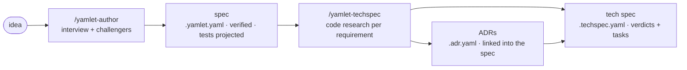

# Yamlet - Yet Another Markup Language Engineering Toolkit

Spec-driven development for agents, with as little text as possible.

A spec is one `.yamlet.yaml` file per component: a contract, a few requirements,
and [EARS](https://alistairmavin.com/ears/) acceptance criteria. Composites wire
specs together. The `yamlet` CLI writes every file; skills interview you and
challenge what you say before anything is committed.

Example: [`email_service.yamlet.yaml`](specs_example/email_service.yamlet.yaml).
More in [`specs_example/`](specs_example/), including the generated `.feature` files.

## The flow


```mermaid
flowchart LR
    I(["idea"]) --> A["/yamlet-author<br/>interview + challengers"]
    A --> S["spec<br/>.yamlet.yaml · verified · tests projected"]
    S --> E["/yamlet-techspec<br/>code research per requirement"]
    E --> T["tech spec<br/>.techspec.yaml · verdicts + tasks"]
    E --> D["ADRs<br/>.adr.yaml · linked into the spec"]
    D --> T
```

1. **Idea → spec.** `/yamlet-author <one line>` asks whether this is a new spec or
   a change, reads what is already on disk, and interviews you. Before the
   contract is frozen and before each requirement is committed, a challenger
   skill argues against it; you adjudicate. The author ends with `yamlet verify`
   clean and the Gherkin features regenerated.
2. **Spec → tech spec.** `/yamlet-techspec <spec>` reads your code, records one
   verdict per criterion with `file:line` evidence, and writes a task list
   covering every unmet criterion. Where a task needs a decision, `/yamlet-adr`
   records it as an ADR and links it into the spec.
3. **Then it is your setup again.** Steps, code, pipeline: yamlet stops here.

The tech spec is disposable; the spec and its ADRs persist. Keep
`*.techspec.yaml` out of git.

```
/yamlet-author I want the system to send emails over a single TLS SMTP server
/yamlet-author the email service should also retry a failed send twice
/yamlet-techspec specs/email_service.yamlet.yaml
```

## Install

The CLI is one binary for macOS and Linux (x86_64 and arm64):

```sh
brew tap RicardoMonteiroSimoes/yamlet
brew trust --tap RicardoMonteiroSimoes/yamlet   # Homebrew 6+ gates third-party taps
brew install yamlet
```

Without Homebrew: download the tarball for your platform from the
[latest release](https://github.com/RicardoMonteiroSimoes/Yamlet/releases/latest),
check it against `SHA256SUMS`, and put `yamlet` on your `PATH`.

The Claude Code skills ship as a plugin with no binary inside; install the CLI first:

```
/plugin marketplace add RicardoMonteiroSimoes/Yamlet
/plugin install yamlet-skills@yamlet
```

For [pi](https://pi.dev), the same flow is ported under [`pi/`](pi/):

```
pi install git:github.com/RicardoMonteiroSimoes/Yamlet
pi install npm:@tintinweb/pi-subagents   # the challengers and code researcher run as subagents
```

## Why

Existing spec frameworks are verbose, and verbosity is what sends an agent off
into its own interpretation. Nobody reads a wall of adjectives, agents included.
Yamlet keeps a spec to the minimum that still pins the behaviour down, and makes
the tooling argue with you while you write it.

## Skills

Ten skills, bundled as the `yamlet-skills` plugin under
[`plugins/yamlet-skills/`](plugins/yamlet-skills/). No MCP server.

| skill | role |
|---|---|
| `yamlet-author` | creates or changes a spec through the CLI; the entry point |
| `yamlet-contract-challenger` | gate before `yamlet init` freezes the contract |
| `yamlet-criteria-challenger` | gate before each requirement is committed |
| `yamlet-verifier` | runs `yamlet verify`, reports violations by rule ID |
| `yamlet-tester` | regenerates the Gherkin `.feature` tree |
| `yamlet-techspec` | verdicts per criterion, then tasks; the second entry point |
| `yamlet-code-research` | finds where each criterion lives in the code; documents, never judges |
| `yamlet-evidence-challenger` | gate before a criterion is recorded as met |
| `yamlet-adr` | records a decision through `yamlet adr` |
| `yamlet-adr-challenger` | gate inside the ADR flow |

The gates exist because two things are one-way: the contract after `init`, and
committed text. Appending stays open, so a mistake is expensive rather than
unfixable. `yamlet impact` lists every composite it would reach.

On pi the five skills that talk to you stay skills; the five that don't become
`pi-subagents` agents. See [`pi/README.md`](pi/README.md).

## CLI

Every write goes through the CLI. It allocates all IDs (`RQ-1`, `AC-3`, `T-2`,
`ADR-0004`) and never renumbers them.

| command | what it does |
|---|---|
| `yamlet verify FILE` | check a spec against the rule catalog |
| `yamlet systems [DIR]` | list the systems and their scope files |
| `yamlet impact FILE [DIR]` | which composites wire this spec, and how |
| `yamlet graph [FILE\|DIR] --out=F` | DOT, JSON, or interactive HTML view of a spec or a whole directory |
| `yamlet tests SRC TARGET` | project every criterion into a Gherkin `.feature` tree |
| `yamlet init` · `add-requirement` · `add-criterion` | author a spec |
| `yamlet add-component` · `add-connection` | wire a composite |
| `yamlet add-adr` | link a decision record to a requirement or criterion |
| `yamlet techspec …` | build a `.techspec.yaml` |
| `yamlet adr …` | build a `.adr.yaml` |

Exit codes: `0` ok · `1` verify found errors · `2` bad input, nothing written ·
`3` mutation rolled back.

`yamlet help <command>` has the full synopsis.

## Docs

- [`SPEC.md`](SPEC.md): the format, every field and why. The verifier is the source of truth for validity.
- [`tooling/README.md`](tooling/README.md): the binary, the graph model, the HTML viewer, the Gherkin projection.
- [`pi/README.md`](pi/README.md): the pi port.
- [`RELEASING.md`](RELEASING.md): release flow.
