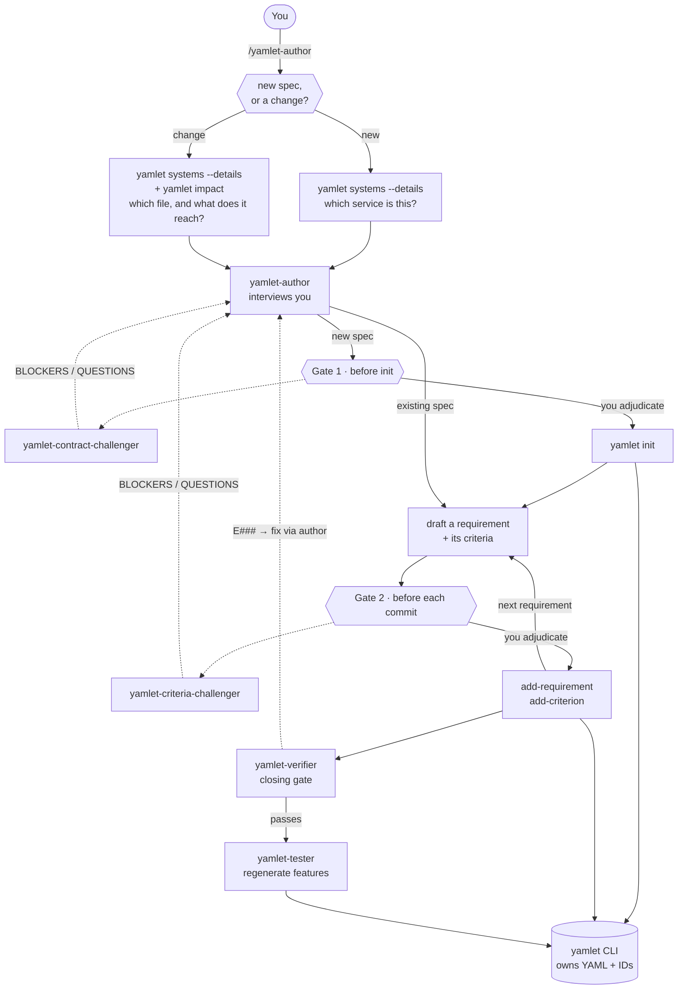

# Yet Another Markup Language Engineering Toolkit

**Yamlet is a minimal, single-source-of-truth spec format for spec-driven development with agents.** One component per `.yamlet.yaml` file, one contract, a handful of requirements, and [EARS](https://alistairmavin.com/ears/) acceptance criteria. Basically, minmaxing the spec game: Write down the minimum that is required, but convey the maximum meaning possible.
All accompanied by a (hopefully) challenging skillset of sparring partners, that result in a quick and easily verifiable spec definition.

[**`email_service.yamlet.yaml`**](specs_example/email_service.yamlet.yaml) is a complete example of _one such_ file. There can be many, and that's the point — each a small scope, focused on the exact, minimal, must-fulfill requirements. The folder [**`specs_example/`**](specs_example/) also contains more examples, as well as the generated test files from the acceptance criteria.

## Install

`yamlet` is a single self-contained binary (no runtime needed) for macOS and
Linux, on both Intel and Apple Silicon / arm64. In addition to this, it's also a plugin
for claude code!

```sh
brew tap RicardoMonteiroSimoes/yamlet          # add the tap (one-time)
brew trust --tap RicardoMonteiroSimoes/yamlet  # trust it (one-time)
brew install yamlet
yamlet --version
```

Homebrew 6+ gates non-official taps behind a trust step: without it, `brew
install` prompts you to confirm the tap on first use. `brew trust --tap`
pre-approves it so the install runs unattended (and covers future upgrades).

Homebrew works on Linux too, so the same commands install it there. To upgrade
later: `brew upgrade yamlet`.

Prefer not to use Homebrew? Every release ships four tarballs —
`yamlet-<version>-{x86_64,aarch64}-apple-darwin.tar.gz` and the matching
`-unknown-linux-gnu` pair — alongside a `SHA256SUMS`. Grab the one for your
platform from the
[latest release](https://github.com/RicardoMonteiroSimoes/Yamlet/releases/latest),
verify it against `SHA256SUMS`, and put the `yamlet` binary on your `PATH`. The
tap is built from those same assets, so `brew install` and a manual install land
the identical binary.

The claude code half can be installed by adding the plugin as follows:

```
/plugin marketplace add RicardoMonteiroSimoes/Yamlet
/plugin install yamlet-skills@yamlet
```

The plugin carries **no binary** — the skills call bare `yamlet` on your `PATH`,
so install the CLI first. The two are versioned independently: the plugin is consumed
straight from the repo, and the skills check the CLI by command name rather than
a version floor, so a skill update never forces a CLI upgrade.

Using [pi](https://pi.dev) instead? The same flow is ported under
[`pi/`](pi/), and installs in one line:

```
pi install git:github.com/RicardoMonteiroSimoes/Yamlet
```

It registers the CLI as
native pi tools (one per subcommand) and blocks hand-editing a `.yamlet.yaml`
outright, so "the file is only ever written by `yamlet`" is enforced rather than
asked for. The two adversarial challengers additionally need
`pi install npm:@tintinweb/pi-subagents`, since pi has no built-in sub-agents.
See [`pi/README.md`](pi/README.md) for the full mapping.

## How it works

Specs are authored, verified, and projected into tests — every write driven by the `yamlet` CLI, which owns all YAML and IDs, so nothing is hand-edited. You start simply by doing `/yamlet-author <your request>`. The goal is for it to challenge you - so if it's being specifically pesky, that's why. 

1. **Route** — the author asks one question before anything else: a **new** spec, or a **change** to one that already exists? Both answers then read what's already on disk with `yamlet systems --details`, so a new spec joins an existing service instead of fragmenting it into a fresh one, and a change lands in the right file rather than a plausible-looking neighbour.
2. **Author** — the `yamlet-author` skill interviews you and appends to the spec through the CLI, so it is deterministically correct. Always. Depending on what you do, it might invoke other skills to challenge what you're doing.
3. **Verify** — `yamlet verify` checks a spec against a mechanical rule catalog, the source of truth for validity.
4. **Project tests** — `yamlet tests` turns every acceptance criterion into a Gherkin `.feature`, ready for your step definitions.

Changing an existing spec adds one read before the interview: `yamlet impact` reports the blast radius — every composite that wires the spec as a member, under which alias, and which of its sockets each one binds. Contracts are total, so widening one reaches every file on that list; you get to see it before you touch anything. And at any point `yamlet graph --format=html` drops out a self-contained interactive viewer of how the whole tree fits together.

After that step, its back to your setup. How you generate the steps, the code, and everything else, depends on you now.
No _dreams of a fully fledged pipeline that will make you financially independent if you throw enough tokens at it_. Just a small part that hopefully improves the spec part of your daily work.

The `yamlet` CLI runs standalone; and in theory can be used by yourself. But where's the fun in that?

## What makes Yamlet so special?

Yamlet is my own try at a reliable, minimalistic setup for spec-driven development with agents — one that doesn't assume you're a hobby startup founder, but serious about the matter and interested in reliable results.

My issue with existing options is that they're verbose and unreliable - the verbosity is at fault here, as it leads agents off through various interpretations of the same goal. Instead of clearly sculpting a goal, they write about how many adjectives fit its description. And nobody reads those in detail, not even agents. Or why are they not following them, hmm? 🧐

But agents suffer from the same pitfalls development teams have suffered the past decades. Unclear requirements, broad scopes, changing goal posts, rushed results, non prioritization of code quality metrics. Until now you paid a pretty penny to people that could manage this field, and could trust their judgement. But agents? They will assume something, misundertand it potentially, and output an avalanche of code based on wrong goals. Good luck reviewing that yourself.

In addition, many of these new "frameworks" are just over the top. Why do I need an mcp server for this? Why do I need 20+ skills to do something? 

# The nerdy bits

## The CLI

One binary, one data-driven command registry — `yamlet help` generates its own
table from that registry, so the help can never drift from the code. The
read-only commands first, then the authoring primitives the skills orchestrate:

| command | what it does |
|---|---|
| `yamlet verify FILE` | check a spec against the rule catalog; `--list-rules` prints the catalog itself |
| `yamlet systems [DIR]` | which systems exist, grouped by their scope files. `--details` adds each scope's summary and description (a topic alone rarely separates two scopes of one service), `--contracts` its exposed signature, `--system=SLUG` narrows to one |
| `yamlet impact FILE [DIR]` | the reverse of `components:` — which composites declare this spec as a member, under which alias, and which sockets each one binds, consumes or names in prose |
| `yamlet graph [FILE\|DIR]` | a DOT, JSON, or interactive HTML view of one spec or a whole directory |
| `yamlet tests SRC TARGET` | project every acceptance criterion into a Gherkin `.feature` tree |
| `yamlet init FILE ...` | create a spec, contract and all, correct by construction |
| `yamlet add-component` · `add-connection` | declare a composite's members, and wire them a group at a time |
| `yamlet add-requirement` · `add-criterion` | append a requirement, or a criterion under any requirement — `--after AC-N` inserts behind a named sibling instead of appending |

Every mutating command allocates the IDs itself and echoes them on stdout —
`RQ-1`, `AC-3` — and never takes one as input. IDs are never reused and never
renumbered: an inserted criterion gets a letter-suffixed id on its anchor (after
`AC-3` comes `AC-3a`) so it sorts into place while the projected Gherkin manifest,
which keys on those ids, stays valid. `edit` and `rm` are deliberately not
implemented yet.

Exit codes are the contract the skills read: `0` success · `1` verify found
errors · `2` usage or validation error, nothing written · `3` a mutation produced
an unexpected finding and was rolled back.

Full synopses live in the binary (`yamlet help <command>`) and in
[`tooling/README.md`](tooling/README.md#command-surface).

## The format
(This section is AI generated and not adapted by me, so read at your own caution)

The full, authoritative definition of every field — including what `front` and
`blast_radius` actually mean and why — lives in [`SPEC.md`](SPEC.md). The `yamlet`
verifier (`yamlet verify`, in `tooling/`) is the mechanical source of truth for
validity. What follows is a quick reference only.

### Top-level keys

All required: `system` (a slug, `^[a-z0-9]+(-[a-z0-9]+)*$`), `topic`, `summary`,
`description`, `blast_radius` (`low`\|`medium`\|`high`), `front`
(`internal`\|`external`), and a non-empty `requirements` list (optional on a
composite). Three are optional: `exposes`, `components`, `connections`.

### The contract (`exposes`)

`exposes` declares the component's contract signature — a `name`, an `intent`,
named `inputs`, and optional named `outputs` (the return half). Criteria reference
these as `{input.NAME}` / `{output.NAME}`, and the binding is checked both ways:
every reference must resolve, and every declared input/output must be used. See
[`SPEC.md`](SPEC.md#exposes--the-contract-signature).

### Composition (`components` + `connections`)

`components` makes the file a **composite** — a level above the component that
wires several member specs together. Members are listed as `alias: path`; the
wiring lives in a `connections:` block written `sink: source` (e.g.
`attachment: uploads.pdf_file`), where each endpoint is either the composite's own
boundary port (`input.NAME` / `output.NAME`) or a member socket (`alias.socket`).

Verification is cross-file and **total**: it resolves every endpoint against the
members' `exposes`, fixes dataflow direction by resolving sinks and sources
asymmetrically, and enforces completeness — every member input must be wired. A
composite's own `requirements:` are optional, reserved for emergent obligations no
wire expresses.

[`pdf_archiver.yamlet.yaml`](specs_example/pdf_archiver.yamlet.yaml) is a worked
example wiring [`pdf_upload`](specs_example/pdf_upload.yamlet.yaml) into
[`email_service`](specs_example/email_service.yamlet.yaml). See
[`SPEC.md`](SPEC.md#composition--a-level-above-the-component).

### Requirements & acceptance criteria

Each **requirement** has an `id` (`RQ-N`), a `description`, and a non-empty list of
`acceptance-criteria`. Each **criterion** has an `id` (`AC-N`), a `pattern`, its
required clause(s), and a non-empty `shall` list:

| pattern | required clause(s) |
|---|---|
| `ubiquitous` | none (always-on) |
| `state` | `while` |
| `event` | `when` |
| `optional` | `where` |
| `unwanted` | `if` |
| `complex` | `while` + exactly one of `when`/`if` |

Placeholders like `{n}` may appear in clause and `shall` text; when they do, an
`examples` table is required and every row must bind every placeholder.

### Visualizing (`yamlet graph`)

`yamlet graph` emits a diagram of any spec's structure — a leaf's contract, or a
composite's boundary-and-wiring block diagram. With no argument it takes the
current directory.

- **`--format=html`** is a self-contained interactive viewer: one file, no build
  step, no server. It navigates **by system** — each level shows every scope that
  shares a `system:` slug (the wired one marked, plus its sibling variants); click
  a member to drill into its system, the breadcrumb to climb back.
  `--libs=embed` (the default) inlines the layout engine so the file works
  offline; `--libs=cdn` references a pinned, SRI-guarded copy instead, for a far
  smaller file that needs network and an origin the page is allowed to reach.
- **`--format=json`** emits a stable, renderer-agnostic graph model
  (`yamlet.graph/v1`) so a custom engine or interactive viewer can display it
  without re-parsing yamlet. The HTML viewer is one such renderer over exactly
  this model.
- **`--format=dot`** (the default for a single spec) is Graphviz DOT for
  `dot -Tsvg` to lay out:
  `yamlet graph specs_example/pdf_archiver.yamlet.yaml | dot -Tsvg > diagram.svg`

Because a project's specs are expected to **live together in one directory**,
`yamlet graph <dir>` (or `--recursive` on a single root) expands the whole
composition tree at once — every root spec, down through nested composites. DOT
renders a single spec at one level, so a directory or `--recursive` implies a
model format (JSON unless you ask for HTML) and `--format=dot` is refused there;
pass `-r` so composite members reached through wiring show their internals rather
than an opaque card. See
[`tooling/README.md`](tooling/README.md#the-graph-model-yamlet-graph---formatjson)
and [the viewer's own section](tooling/README.md#the-html-viewer-yamlet-graph---formathtml).

## Skills

Five Claude Code skills, bundled as the `yamlet-skills` plugin under
[`plugins/yamlet-skills/`](plugins/yamlet-skills/) — no MCP server:

- **`yamlet-author`** — creates a new spec *or* changes one that already exists. It routes on that one question, reads the specs already on disk first (`yamlet systems --details`, plus `yamlet impact` before a change), interviews you, and appends through the `yamlet` CLI; it never writes YAML or picks IDs itself, so the file is correct by construction.
- **`yamlet-contract-challenger`** — adversarial review before `yamlet init` freezes the contract.
- **`yamlet-criteria-challenger`** — adversarial review before each requirement and its criteria are committed.
- **`yamlet-verifier`** — validates a spec against the rules, reporting violations with stable rule IDs.
- **`yamlet-tester`** — projects a specs directory into a Gherkin `.feature` tree, wiping and rebuilding the target every run so the tests never drift. Disconnected: it writes features only, never step definitions.

The two challengers exist because two things are **one-way**: the contract is immutable after `init`, and committed text can't be revised or removed (`edit` and `rm` aren't implemented yet). A spec itself stays open — you can always append a requirement, or a criterion under any requirement — so a mistake isn't unfixable, it's expensive to fix, across every consumer `yamlet impact` lists. A gate at each point is the last cheap chance to catch one.

The [`pi/`](pi/) port carries the same five capabilities, split differently: the three that talk to you stay skills, and the two challengers become `pi-subagents` agents — a pi subagent runs headless and has no way to ask a question, so only an autonomous reviewer can be one. There the challengers are read-only *structurally* (`tools: read, ext:yamlet/yamlet_systems`), because the port also registers the CLI as pi tools rather than shelling out.

### How they interact


```mermaid
flowchart TD
    U(["You"]) -->|"/yamlet-author"| R{{"new spec,<br/>or a change?"}}
    R -->|"new"| S["yamlet systems --details<br/>which service is this?"]
    R -->|"change"| I["yamlet systems --details<br/>+ yamlet impact<br/>which file, and what does it reach?"]
    S --> A["yamlet-author<br/>interviews you"]
    I --> A

    A -->|"new spec"| G1{{"Gate 1 · before init"}}
    G1 -.-> CC["yamlet-contract-challenger"]
    CC -. "BLOCKERS / QUESTIONS" .-> A
    G1 -->|"you adjudicate"| INIT["yamlet init"]

    INIT --> D["draft a requirement<br/>+ its criteria"]
    A -->|"existing spec"| D
    D --> G2{{"Gate 2 · before each commit"}}
    G2 -.-> RC["yamlet-criteria-challenger"]
    RC -. "BLOCKERS / QUESTIONS" .-> A
    G2 -->|"you adjudicate"| C["add-requirement<br/>add-criterion"]
    C -->|"next requirement"| D
    C --> V["yamlet-verifier<br/>closing gate"]
    V -. "E### → fix via author" .-> A
    V -->|"passes"| T["yamlet-tester<br/>regenerate features"]

    INIT --> CLI[("yamlet CLI<br/>owns YAML + IDs")]
    C --> CLI
    T --> CLI
```

Dotted arrows are forked, blocking sub-reviews that write nothing; solid arrows are the main flow. The two reads at the top (`systems`, `impact`) are read-only too — they exist so the author picks the right file before it writes to any. Every write goes through the `yamlet` CLI, which owns all serialization and IDs.

The contract gate only fires on the new-spec route: `init` is what freezes a contract, and a spec that already has one skips straight to drafting requirements. Everything after that point is identical on both routes — same drill-down, same criteria gate, same verify gate, same closing test projection.

You only ever start `/yamlet-author`, seeded with a one-line description — for a new spec or a change alike:

```
/yamlet-author I want the system to send emails over a single TLS SMTP server
/yamlet-author the email service should also retry a failed send twice
```

Everything else fires from inside the flow. At each gate a forked Opus reviewer blocks and hands back objections for you to adjudicate; nothing commits until they're settled, and the author isn't done until `yamlet-verifier` reports no errors — after which it regenerates the Gherkin feature tree via `yamlet-tester` as a mandatory closing step. The others also run standalone — `/yamlet-contract-challenger`, `/yamlet-criteria-challenger`, `/yamlet-verifier <file>`, `/yamlet-tester <specs-dir>` — for a second opinion or a one-off regeneration outside the flow.
