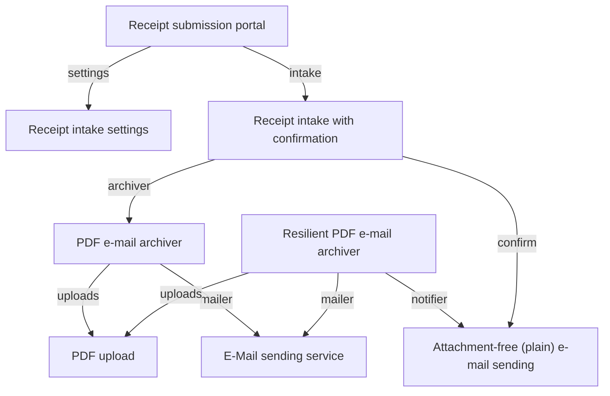

<!-- Generated by `yamlet docs` from the specs under specs_example. Do not edit: changes are overwritten on the next run. -->

# specs_example

4 systems · 8 scopes · 0 decisions

## Systems

### e-mail-sending-service

| Scope | Summary | Caller | Blast radius |
|---|---|---|---|
| [E-Mail sending service](e-mail-sending-service/email_service.md) | A generic e-mail sending service that exposes a contract for others to send e-mails with a given content | Internal | High |
| [Attachment-free (plain) e-mail sending](e-mail-sending-service/email_service_plain.md) | A scope of the e-mail sending service that sends a plain e-mail — subject and content only, no attachment. | Internal | High |

### pdf-archiver

| Scope | Summary | Caller | Blast radius |
|---|---|---|---|
| [PDF e-mail archiver](pdf-archiver/pdf_archiver.md) | E-mails a validated PDF out to a configured archive address once it is uploaded. | Internal | Medium |
| [Resilient PDF e-mail archiver](pdf-archiver/pdf_archiver_resilient.md) | Archives an uploaded PDF by e-mail, and when the upload fails sends an attachment-free notification e-mail instead. | Internal | Medium |

### pdf-upload

| Scope | Summary | Caller | Blast radius |
|---|---|---|---|
| [PDF upload](pdf-upload/pdf_upload.md) | Accepts an uploaded file, verifies it is a well-formed PDF, and returns the validated PDF. | External | Medium |

### receipt-intake

| Scope | Summary | Caller | Blast radius |
|---|---|---|---|
| [Receipt intake settings](receipt-intake/intake_settings.md) | Supplies the deployment-configured archive and confirmation e-mail settings for receipt intake. | Internal | Medium |
| [Receipt intake with confirmation](receipt-intake/receipt_intake.md) | Archives an uploaded receipt PDF by e-mail and sends the submitter a plain confirmation that it was received. | Internal | Medium |
| [Receipt submission portal](receipt-intake/receipt_portal.md) | The public entry point where a submitter hands in a receipt PDF for archiving and confirmation. | External | Medium |

## Composition

Which scope is built from which; arrows are labelled with the member alias.

