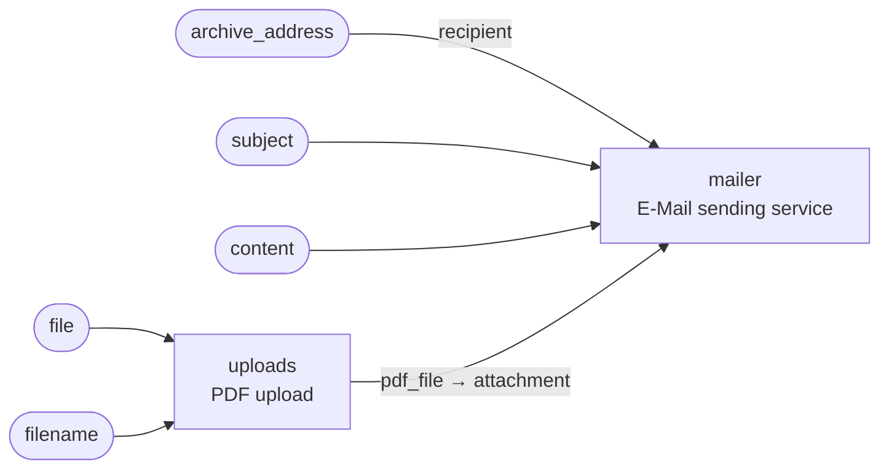

<!-- Generated by `yamlet docs` from pdf_archiver.yamlet.yaml. Do not edit: changes are overwritten on the next run. -->

# PDF e-mail archiver

> E-mails a validated PDF out to a configured archive address once it is uploaded.

- **System:** [pdf-archiver](../index.md#pdf-archiver)
- **Caller:** Internal — the caller is inside the trust boundary
- **Blast radius:** Medium
- **Source:** [`pdf_archiver.yamlet.yaml`](../../../../../specs_example/pdf_archiver.yamlet.yaml)

Wires the PDF upload surface to the e-mail service: when an uploaded PDF is validated and returned, it is e-mailed to a configured archive address.

## Contract

`pdf-archiver` — archive an uploaded PDF by e-mailing it to a configured archive address

- **Inputs:** `file`, `filename`, `archive_address`, `subject`, `content`
- **Outputs:** none

## Members

| Alias | Scope | Summary |
|---|---|---|
| `uploads` | [PDF upload](../pdf-upload/pdf_upload.md) | Accepts an uploaded file, verifies it is a well-formed PDF, and returns the validated PDF. |
| `mailer` | [E-Mail sending service](../e-mail-sending-service/email_service.md) | A generic e-mail sending service that exposes a contract for others to send e-mails with a given content |

## Wiring

| Into | From |
|---|---|
| `uploads.file` | `file` (input of this scope) |
| `uploads.filename` | `filename` (input of this scope) |
| `mailer.recipient` | `archive_address` (input of this scope) |
| `mailer.subject` | `subject` (input of this scope) |
| `mailer.content` | `content` (input of this scope) |
| `mailer.attachment` | `uploads.pdf_file` |

## Requirements

### RQ-1 · A validated PDF returned by the upload surface is reliably delivered to the configured archive address

**AC-1** · When `uploads.pdf_file` is returned, the system shall:

- ensure the archive e-mail is sent successfully

## Used by

- [Receipt intake with confirmation](../receipt-intake/receipt_intake.md) as `archiver`
