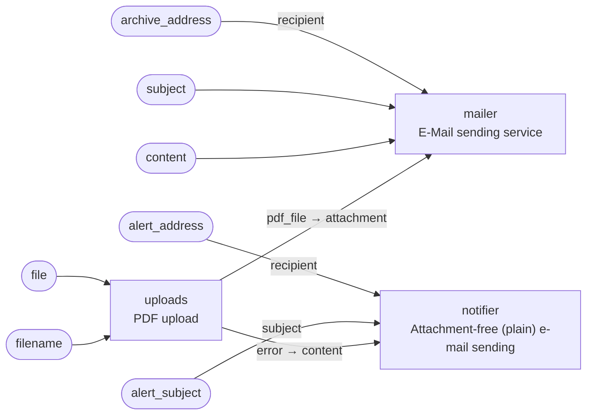

<!-- Generated by `yamlet docs` from pdf_archiver_resilient.yamlet.yaml. Do not edit: changes are overwritten on the next run. -->

# Resilient PDF e-mail archiver

> Archives an uploaded PDF by e-mail, and when the upload fails sends an attachment-free notification e-mail instead.

- **System:** [pdf-archiver](../index.md#pdf-archiver)
- **Caller:** Internal — the caller is inside the trust boundary
- **Blast radius:** Medium
- **Source:** [`pdf_archiver_resilient.yamlet.yaml`](../../../../../specs_example/pdf_archiver_resilient.yamlet.yaml)

A larger archiver: it wires the PDF upload surface to two scopes of the e-mail sending service — the attachment-carrying sender for the success path and the attachment-free notification sender for the failure path. When an uploaded PDF is validated and returned it is e-mailed to the archive address as an attachment; when the upload returns no PDF, a plain notification e-mail is sent to an alert address instead.

## Contract

`pdf-archiver-resilient` — archive an uploaded PDF by e-mail, or notify by e-mail when the upload fails

- **Inputs:** `file`, `filename`, `archive_address`, `subject`, `content`, `alert_address`, `alert_subject`
- **Outputs:** none

## Members

| Alias | Scope | Summary |
|---|---|---|
| `uploads` | [PDF upload](../pdf-upload/pdf_upload.md) | Accepts an uploaded file, verifies it is a well-formed PDF, and returns the validated PDF. |
| `mailer` | [E-Mail sending service](../e-mail-sending-service/email_service.md) | A generic e-mail sending service that exposes a contract for others to send e-mails with a given content |
| `notifier` | [Attachment-free (plain) e-mail sending](../e-mail-sending-service/email_service_plain.md) | A scope of the e-mail sending service that sends a plain e-mail — subject and content only, no attachment. |

## Wiring

| Into | From |
|---|---|
| `uploads.file` | `file` (input of this scope) |
| `uploads.filename` | `filename` (input of this scope) |
| `mailer.recipient` | `archive_address` (input of this scope) |
| `mailer.subject` | `subject` (input of this scope) |
| `mailer.content` | `content` (input of this scope) |
| `mailer.attachment` | `uploads.pdf_file` |
| `notifier.recipient` | `alert_address` (input of this scope) |
| `notifier.subject` | `alert_subject` (input of this scope) |
| `notifier.content` | `uploads.error` |

## Requirements

### RQ-1 · A validated PDF is archived by e-mail, and a failed upload is notified by e-mail instead

**AC-1** · When `uploads.pdf_file` is returned, the system shall:

- ensure the archive e-mail carrying the PDF as an attachment is sent successfully

**AC-2** · If the upload returns an `uploads.error` and no `uploads.pdf_file`, then the system shall:

- ensure a notification e-mail carrying `uploads.error` is sent to the alert address
- ensure the notification e-mail carries no attachment
