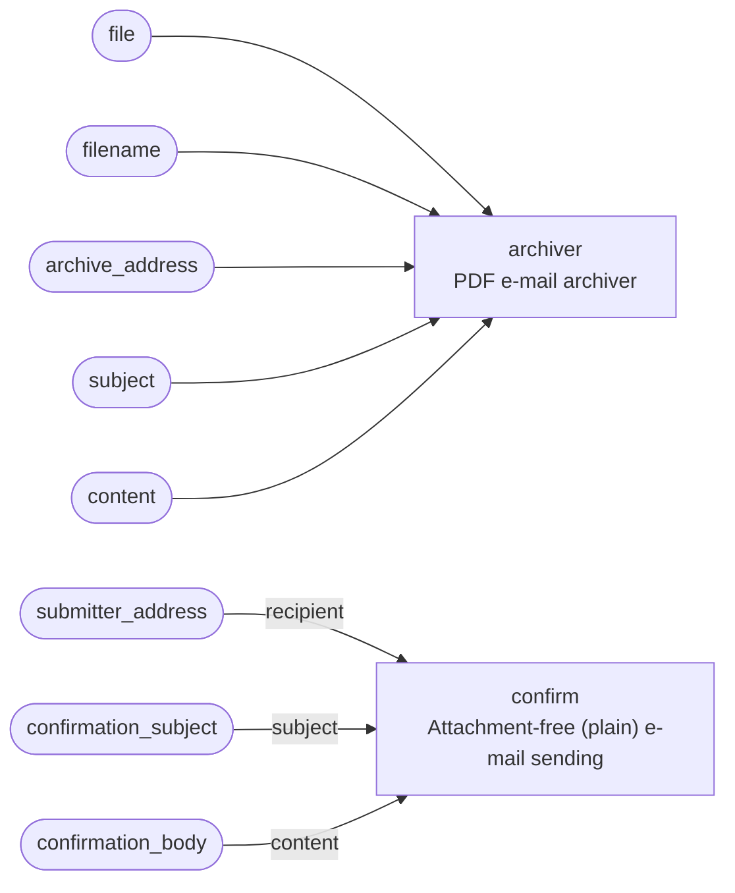

<!-- Generated by `yamlet docs` from receipt_intake.yamlet.yaml. Do not edit: changes are overwritten on the next run. -->

# Receipt intake with confirmation

> Archives an uploaded receipt PDF by e-mail and sends the submitter a plain confirmation that it was received.

- **System:** [receipt-intake](../index.md#receipt-intake)
- **Caller:** Internal — the caller is inside the trust boundary
- **Blast radius:** Medium
- **Source:** [`receipt_intake.yamlet.yaml`](../../../../../specs_example/receipt_intake.yamlet.yaml)

A composite intake surface: it wires the PDF e-mail archiver to the attachment-free e-mail sender so a single submission is both archived and acknowledged. When a receipt PDF is submitted it is handed to the archiver, which validates and e-mails it to the configured archive address; in the same intake a plain confirmation e-mail is sent to the submitter. It owns no work of its own — it is the boundary that couples archiving and acknowledgement into one act.

## Contract

`receipt-intake` — archive a submitted receipt PDF by e-mail and confirm receipt to the submitter

- **Inputs:** `file`, `filename`, `archive_address`, `subject`, `content`, `submitter_address`, `confirmation_subject`, `confirmation_body`
- **Outputs:** none

## Members

| Alias | Scope | Summary |
|---|---|---|
| `archiver` | [PDF e-mail archiver](../pdf-archiver/pdf_archiver.md) | E-mails a validated PDF out to a configured archive address once it is uploaded. |
| `confirm` | [Attachment-free (plain) e-mail sending](../e-mail-sending-service/email_service_plain.md) | A scope of the e-mail sending service that sends a plain e-mail — subject and content only, no attachment. |

## Wiring

| Into | From |
|---|---|
| `archiver.file` | `file` (input of this scope) |
| `archiver.filename` | `filename` (input of this scope) |
| `archiver.archive_address` | `archive_address` (input of this scope) |
| `archiver.subject` | `subject` (input of this scope) |
| `archiver.content` | `content` (input of this scope) |
| `confirm.recipient` | `submitter_address` (input of this scope) |
| `confirm.subject` | `confirmation_subject` (input of this scope) |
| `confirm.content` | `confirmation_body` (input of this scope) |

## Requirements

### RQ-1 · A submitted receipt is, in one intake, both archived by e-mail and acknowledged to the submitter

**AC-1** · When `file` named `filename` is submitted, the system shall:

- hand `file` to the archiver to be e-mailed to `archive_address`
- send a plain confirmation e-mail to `submitter_address`

## Used by

- [Receipt submission portal](receipt_portal.md) as `intake`
