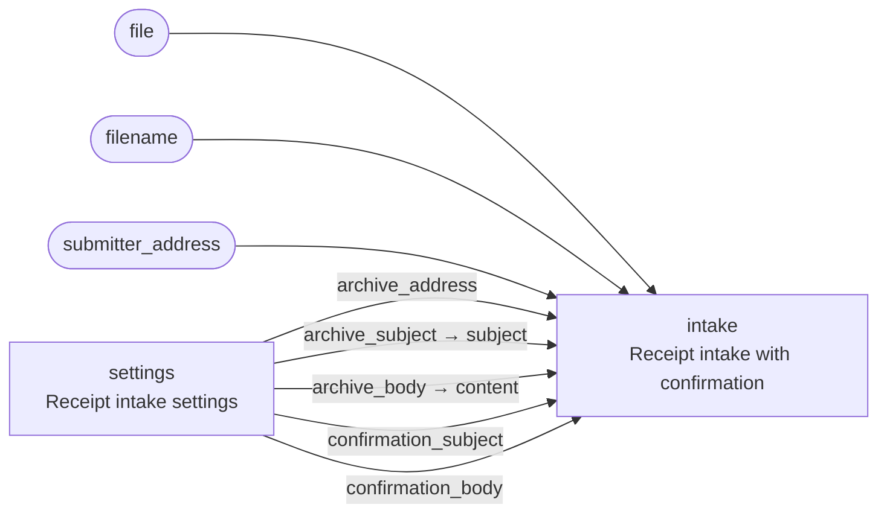

<!-- Generated by `yamlet docs` from receipt_portal.yamlet.yaml. Do not edit: changes are overwritten on the next run. -->

# Receipt submission portal

> The public entry point where a submitter hands in a receipt PDF for archiving and confirmation.

- **System:** [receipt-intake](../index.md#receipt-intake)
- **Caller:** External — the caller is outside the trust boundary
- **Blast radius:** Medium
- **Source:** [`receipt_portal.yamlet.yaml`](../../../../../specs_example/receipt_portal.yamlet.yaml)

The external boundary of the receipt intake: an untrusted submitter supplies only the file, its name and their own address. Every other value the intake needs — the archive address and the e-mail subjects and bodies — is wired from the deployment's settings, so a submitter can never choose where a receipt is archived. It throttles submissions per submitter before anything reaches the intake.

## Contract

`receipt-portal` — accept a receipt PDF from a submitter and hand it to the receipt intake

- **Inputs:** `file`, `filename`, `submitter_address`
- **Outputs:** none

## Members

| Alias | Scope | Summary |
|---|---|---|
| `intake` | [Receipt intake with confirmation](receipt_intake.md) | Archives an uploaded receipt PDF by e-mail and sends the submitter a plain confirmation that it was received. |
| `settings` | [Receipt intake settings](intake_settings.md) | Supplies the deployment-configured archive and confirmation e-mail settings for receipt intake. |

## Wiring

| Into | From |
|---|---|
| `intake.file` | `file` (input of this scope) |
| `intake.filename` | `filename` (input of this scope) |
| `intake.submitter_address` | `submitter_address` (input of this scope) |
| `intake.archive_address` | `settings.archive_address` |
| `intake.subject` | `settings.archive_subject` |
| `intake.content` | `settings.archive_body` |
| `intake.confirmation_subject` | `settings.confirmation_subject` |
| `intake.confirmation_body` | `settings.confirmation_body` |

## Requirements

### RQ-1 · A submitter who floods the portal is throttled before the intake sees the receipt

**AC-1** · If `submitter_address` has submitted more than `<max_submissions>` receipts in the past hour, then the system shall:

- reject `file` without handing it to the intake

Examples:

| `<max_submissions>` |
|---|
| 10 |
